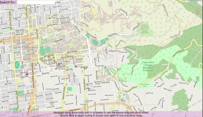
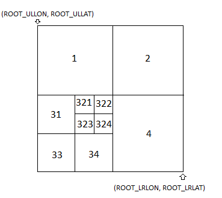

# bearmaps

## Overview
BearMaps is an interactive web-mapping application for the greater Berkeley area. Along with my project partner, we developed the backend implementation written in Java and built off the ApacheMaven integration with IntelliJ IDE. Specifically, we used tile images and map feature data from OpenStreetMap to develop a rastered map using an underlying graph data structure, a routing feature based on the A* search algorithm, and a search bar feature with autocomplete. We focused on writing clean, object-oriented code and debugged using IntelliJ's built-in debugger and JUnit testing. See project [specs here] (https://cs61bl.org/su16/materials/proj/proj3/proj3.html).

## Want to run?
- ### Heroku web app
	- http://bearmaps-lorenjiang.herokuapp.com/map.html
	
- ### Local `.jar` executable
	- Download `bearmaps-1.0-jar-with-dependencies.jar` and execute (see GDrive link below)
		- https://drive.google.com/drive/folders/1wIiM5Z_d4msd5zPA0JNkmHRPzSV5uKqE?usp=sharing 
		- Note: must have JDK installed (see https://www.oracle.com/technetwork/java/javase/downloads/jdk8-downloads-2133151.html)

## Project design outline
Source files can be found under `.\src\main`
- ### MapServer.java
	- Initializes and assigns connection to port. 
	- Passes queries to other classes to render page
	
- ### GraphDB.java
	- Reads in [OpenStreetMap](https://www.openstreetmap.org/) data, parses it with a [SAX Parser] (https://docs.oracle.com/javase/tutorial/jaxp/sax/index.html), and stores it in an underlying graph structure 
	- Implements a [Trie] (https://en.wikipedia.org/wiki/Trie) data structure for autocomplete in the search box

- ### QuadTree.java
	- Given current map coordinate values and window size, figures out which 4 tile images to stitch together to create output view
	- Underlying data structure is a [QuadTree](https://en.wikipedia.org/wiki/Quadtree) (each node has 4 children)
	- Zooming in and out is essentially traversing a QuadTree (see picture below)
	- 
	- Uses lazy loading to only raster the actual images when they are needed 
